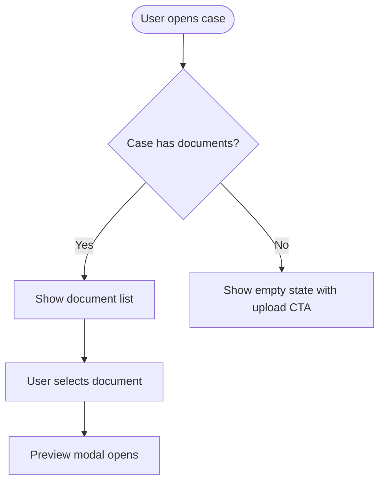

# Prototype

Generates a prototype at one of three fidelity levels — diagram, clickable HTML mockup, or a real Angular component — for any Jira ticket or ad-hoc feature idea. A force multiplier for design thinking, not a replacement for design or engineering work.

Formerly the `/design` skill. Renamed and restructured around fidelity levels: what used to be a fixed pipeline (flow + wireframe, then optionally an Angular build) is now "pick the altitude first, then build just that."

## Configuration

This skill carries no company or workspace specifics. Anything environment-shaped — the ticket
system, the design system, the app the level-3 build lands in — comes from the context config
the project declares.

**Resolve it first:** the project's `CLAUDE.md` declares `company: <name>` and the path to that
context's config directory; read `tools.yml` there. Keys used: `ticket_source`, `design_system`,
`prototype`.

**What works without config, and what stops.** This grading is deliberate — the cheap levels are
genuinely useful anywhere, and the expensive ones fail loudly rather than guessing:

| Capability | Needs | If absent |
|---|---|---|
| Level 1 (diagram) | nothing | works |
| Level 2 (clickable HTML) | nothing | works, on the template's placeholder palette — say so |
| Design-system fidelity | `design_system` | keep the placeholder tokens and say they are placeholders |
| Fetch / post to a ticket | `ticket_source` | work from the inline description; never invent a key |
| Level 3 (real component) | `prototype` | **stop** and name the missing block |
| Figma export | `prototype.figma` | **stop** and name the missing block |

Never substitute a guess for a missing key. A prototype built against invented paths or invented
brand colors is worse than one that did not get built, because it looks finished.

## Invocation

- `/prototype <TICKET-KEY>` — fetch the ticket, ask which fidelity level (unless already stated)
- `/prototype <TICKET-KEY> clickable` / `... level 2` — skip the fidelity question
- `/prototype` — the user pastes or describes a feature idea inline; no ticket needed at all
- Mid-session escalation — "make it clickable" or "prototype it for real" jumps from a lower level straight to a higher one without repeating earlier steps

## The three fidelity levels

If the user doesn't say which level they want, ask — don't guess. The levels trade speed for realism, and picking wrong wastes their time either way (too low and he has to ask again; too high and you've burned effort on polish nobody needed yet).

1. **Diagram** — a Mermaid user-flow, viewable as a standalone HTML file. Cheapest to produce and cheapest to throw away. Right for nailing down a flow or agreeing on the happy path and edge cases before anyone has opinions about pixels.
2. **Clickable prototype** — a single self-contained HTML file: styled like a real screen, populated with realistic mock data, and wired up so tabs, buttons, forms, and navigation actually respond (everything in-memory, nothing persists, nothing calls out). No server, no build step — double-click to open. Right for stakeholder demos and gut-checking that a flow *feels* right before committing engineering time.
3. **Mocked-out real solution** — an actual component in the workspace named by `prototype.root`, built from the real components in its catalog, run with the configured serve command. Right for engineering handoff, or when it needs to look and behave byte-for-byte like what will ship.

## Design system

If `design_system` is configured and exposes an MCP server, it is the source of truth — build on
it rather than on invented colors or guessed styling. That is what makes a prototype read as a
real product screen instead of a generic mock. Use it at whatever depth the fidelity level warrants:

- **`get-tokens`** — real tokens (colors, spacing, radii, typography). Follow any resolution notes
  the config records; systems differ in how primitives map to semantic roles.
- **`check-contrast`** — before committing any colored-text-on-tint pairing (status pills, badges,
  banners), verify **WCAG AA**. Mid shades frequently fail AA on their own light tints; step darker
  for text. Don't ship a pairing you haven't checked.
- **`list-components` / `search-components` / `get-component` / `get-usage-example`** — the real
  component inventory, props, slots, events, and ready-to-use markup. Use these to name and shape
  components correctly at any level.
- **audit/score helpers** (`audit-spacing`, `audit-typography`, `score-alignment`, `suggest-token`)
  — for tightening a build against the system once the structure is in place.

**Per level:**
- **Level 1** — no styling to speak of; skip unless naming a real component in the wireframe notes.
- **Level 2** — the template ships **neutral placeholder tokens**. Replace that block with real
  tokens when a design system is configured, and `check-contrast` anything new. With no design
  system configured, keep the placeholders and say plainly that the colors are not the brand's.
- **Level 3** — pair the component catalog with the MCP: the catalog lists what is actually wired
  into the workspace, the MCP gives authoritative props and tokens. Prefer real components and
  token CSS vars over hand-rolled styles.

If the MCP is configured but unavailable this session, fall back to the template tokens and say
so — never silently invent brand colors.

## Step 1: Get the input

If a ticket key is provided:
- Fetch it from the configured `ticket_source`, requesting summary, description, issue type, and
  the acceptance-criteria and requirements fields named in `ticket_source.fields`.
- No `ticket_source` configured → say so and ask for the feature description inline.
- If the ticket has no description and no AC: ask the user to describe the feature before proceeding.

If no ticket key: treat the message as an ad-hoc feature description. Parse it directly — don't require a ticket to exist first. If it's too thin to work with (a one-line idea with no sense of the flow), ask a couple of clarifying questions before generating anything.

## Step 2: Pick the fidelity level

If the user named a level in the invocation, use it. Otherwise, briefly describe the three options above and ask. Default to assuming they want to iterate up (start cheap, escalate once the flow is agreed) rather than jumping straight to level 3 unless they're clearly asking for the real thing.

## Step 3: Generate the design source

This is the shared blueprint behind every fidelity level — produce it regardless of which level was chosen. For level 1 it *is* the deliverable; for levels 2 and 3 it's what drives the build.

**Flow (Mermaid)** — `graph TD` for sequential flows or `flowchart LR` for parallel paths. Include:
- Entry point (how the user gets here)
- Happy path
- Key decision nodes
- Error states and recovery paths
- Edge cases from AC, if present
- Terminal states (success, error, cancel/exit)



**Screen-by-screen wireframe** — for each distinct screen or modal state:

```
**Screen N: [Name]**
- **Purpose**: what this screen accomplishes for the user
- **Key elements**: inputs, buttons, tables, modals, nav — be specific
- **States**: empty / loading / error / success
- **Interactions**: [user action] → [what happens]
- **Design system hints**: existing components from the catalog that fit (e.g. "the list component for the case list")
```

Scale depth to the source: a story gets detailed per-screen specs matching the AC; an epic gets a higher-level flow with screen specs only at the feature level. If AC is well-defined, generate straight from it; otherwise infer from the description and say out loud what you assumed.

## Step 4: Propose & revise

Display the flow and wireframe (even if the target is level 2 or 3 — the user should see the blueprint before you build on it). Ask:
> "Does this capture the intent? Say 'update [screen/flow]' to revise, or 'looks good' to build the [level] prototype."

Re-generate only what's called out, re-display, repeat until approved.

## Step 5: Build the artifact

**Where everything lives**: `<prototype.root>/<prototype.output_subdir>/[slug]/` — one directory per feature, regardless of fidelity level or whether it came from a ticket. Derive `[slug]`:
- From a ticket: `PROJ-1234` → `proj-1234-[short-feature-name]`
- Ad-hoc: kebab-case the feature name, e.g. "case timeline redesign" → `case-timeline-redesign`

### Level 1 — Diagram

Write `prototypes/[slug]/diagram.html`, a standalone Mermaid viewer:

```html
<!DOCTYPE html>
<html lang="en">
<head>
  <meta charset="UTF-8">
  <title>[Feature Name] — User Flow</title>
  <script src="https://cdn.jsdelivr.net/npm/mermaid/dist/mermaid.min.js"></script>
  <style>
    body { font-family: sans-serif; padding: 2rem; background: #fafafa; }
    h2 { color: #333; }
    .mermaid { background: white; padding: 1.5rem; border-radius: 8px; box-shadow: 0 1px 4px rgba(0,0,0,.1); }
  </style>
</head>
<body>
  <h2>[Feature Name] — User Flow</h2>
  <div class="mermaid">
[mermaid diagram content — no code fences, just the raw diagram]
  </div>
  <script>mermaid.initialize({ startOnLoad: true, theme: 'default' });</script>
</body>
</html>
```

Also write `prototypes/[slug]/wireframe.md` with the screen-by-screen description from Step 3.

Tell the user: "Open `prototypes/[slug]/diagram.html` in your browser to view the flow."

### Level 2 — Clickable HTML prototype

Copy `assets/prototype-template.html` (in this skill's directory) to `prototypes/[slug]/prototype.html` as your starting point — it already has the design tokens, light/dark theming, a compact single-row topbar, a small client-side router, and a persistent left **drawer** holding every administrative control (data state, save/load, theme, and — rarely — a demo-only view switcher, see below), plus reference `list`/`detail` views showing the click-through pattern. Don't rewrite this boilerplate from scratch each time; edit the copy.

**The rule of thumb for the drawer**: anything about running the prototype *as a tool* belongs in it — anything that's part of the *feature being demoed* belongs in the main content, no matter how "administrative" it looks. A filter bar, a status legend that's actually part of the screen, a form's own field — those stay inline, because a stakeholder needs to see and use them without hunting through a drawer. The drawer is for chrome the feature itself doesn't own: swapping mock data volume, saving/loading a scenario, and theme.

**Real app navigation is not admin tooling — this is the mistake to avoid.** If the feature has its own persistent navigation between top-level screens (a nav rail, a tab bar, whatever the shipped product would actually have), that navigation is part of the feature being demoed and belongs in the main app content, always visible, exactly like it would in production — never inside the collapsible drawer. Build it as ordinary markup in the app shell (a `<nav>` alongside `.main` inside `.app`, styled however this feature's real nav would look) and wire it with the same `navTo`/`data-nav` pattern. The drawer's own "View" section is reserved for a narrower, rarer case: combining things that would *never* coexist as one navigable UI in production — e.g. three separate role-restricted portals shown as tabs purely so one prototype file can demo all three without juggling separate files — and even then, say so explicitly in the field-reference doc so nobody mistakes it for real navigation. When in doubt, it's real navigation, not a demo convenience — put it in the app.

**It mimics the collapsible sidebar pattern from tools like Jira, deliberately** — match it rather than reinventing: the sidebar is **collapsed by default** (`body.drawer-collapsed` set in the HTML), so the feature owns the full screen on load; expanding it docks it open, shifting `.app` over via `margin-left` rather than overlaying the content. The *topbar* — not the sidebar — spans the full width at all times and never moves. The one toggle icon (a small inline SVG, not text or an emoji) lives at the far left of that topbar, exactly like Jira's icon sits above its sidebar rather than inside it — that's what keeps it reachable no matter whether the sidebar is open or collapsed, and it's why the sidebar itself has no header/title of its own (the topbar already establishes the page's identity; the sidebar's content just starts). Clicking the icon toggles collapsed state; the icon never changes, only its `title` tooltip ("Collapse sidebar" / "Expand sidebar"), same as Jira. The toggle icon is the only way to expand/collapse the sidebar — deliberately, there is no hover-to-open strip along the screen's left edge (that was tried and removed; opening the drawer just by grazing the left edge is distracting during a demo). Nothing here auto-collapses when you pick an action (switch view, switch data state, save, load) — a real sidebar doesn't disappear just because you clicked something in it. All of this is generic, driven off a single `body.drawer-collapsed` class; it doesn't need touching per-prototype.

From there:
- Replace the `views` object with one function per screen from the wireframe. Keep the pattern: each view returns a DOM node, `navTo(viewKey, opts)` switches between them, `state` carries whatever context the next view needs (like `itemId`).
- **App navigation**: if the feature has more than one top-level screen, build real persistent navigation for it in the main app content (not the drawer) — see "Real app navigation is not admin tooling" above. Delete the template's drawer "View" `.menu-section` entirely unless this is the narrow demo-only-combination case described above.
- Replace `DATA_STATES` with the feature's real data, defining all three variants — this is not optional polish, it's the point of the switcher:
  - **typical**: a handful of representative rows/records covering the statuses and edge cases that matter for this feature
  - **empty**: zero rows — and make sure the view actually renders a real empty-state message when `db` is empty, not just a blank table. If the wireframe never specified what "no results" looks like, that's exactly the gap this is meant to catch — decide it now rather than leaving a blank card in the demo.
  - **overloaded**: enough rows to plausibly stress the screen (50–100+, or more if production volume would be higher) with a few deliberately long field values, so table wrapping, truncation, and pagination get a real look before engineering hits the same problem
  - Every screen built from this data should react correctly to all three — if a screen only makes sense in one data state (e.g. a form that's always "empty" until filled in), it's fine for its data-agnostic parts to ignore the switcher, but say so rather than leaving it silently broken.
- Leave the **Save / Load scenario** controls alone — they need no per-screen work. The logger watches every field change and click across the whole document via event delegation, so it automatically logs a readable interaction trail and can export/re-import an exact `db` + `state` snapshot no matter what screens you build. This is what lets the user capture what a stakeholder did during a demo and reload that exact scenario later, without adding any scope to the prototype itself. The only thing you might need to do: if a screen adds a genuinely custom meta-control that shouldn't clutter the log (most won't), tag it `data-no-log`, the same way the menu's own controls tag themselves.
- Replace the `db` mock data with data that matches the feature — shape it so the screens can be genuinely clicked through, not just visually present. If completing a task should change something (mark an appointment reported, add a note, change a status), mutate `db` in the click handler and call `render()` — that's what makes it feel real instead of static.
- The toggle icon needs the topbar to live in — if the feature is a single screen or modal that doesn't otherwise need a topbar, keep a minimal one anyway (just the icon, maybe the brand) rather than dropping it, since that's the one place the icon can sit and still be reachable when the sidebar is collapsed. The drawer itself is `position: fixed` and doesn't depend on the topbar's layout beyond that.
- Reuse the existing primitives (`.stat`, `.pill`, `.tbl`, `.tabs`, `.field`, `.toast`, `.modal-backdrop`, `.drawer`, `.data-state-switch`, `.menu-section`) rather than inventing new CSS for things the template already covers. Use `.menu-btn-row.stack` instead of the default wrapped row for any button group in the drawer with more than two or three options, or with longer labels — the drawer is narrow and vertical, closer to a nav list than a toolbar.
- No decorative emoji anywhere — not in button labels, pills, table cells, or toasts. These are prototypes demoed to clients and stakeholders; pictorial emoji (📄💾👮 etc.) read as unpolished and distract from the feature itself. Plain text labels do the same job more credibly ("Save" not "💾 Save", "Packet" not "📄"). The exception is a small set of monochrome, near-universal UI glyphs that function as icons rather than decoration — `✕` (close), `▸`/`▾` (disclosure triangles), and small single-color inline SVGs like the sidebar toggle icon — those are fine to keep since they're not really "emoji" in the way a stakeholder would object to.
- The token block at the top of the template holds **neutral placeholders**, not anyone's brand. If a design system is configured, replace that block with real tokens via `get-tokens` and run `check-contrast` on any colored-text-on-tint pairing. If none is configured, keep the placeholders and say plainly that the colors aren't the brand's. Never swap in guessed "official" colors — the MCP is the only concrete source.

Tell the user: "Open `prototypes/[slug]/prototype.html` in your browser — it's fully clickable, no server needed." Then generate the field reference doc below before wrapping up.

### Level 3 — Mocked-out Angular solution

**a. Read the catalog + query the design system** — read `<prototype.root>/<prototype.component_catalog>` to identify what's wired into the workspace, and use the configured design-system MCP (`list-components`, `get-component`, `get-usage-example`, `get-tokens`) for authoritative component props/usage and design tokens before writing any UI code. Style with DS token CSS variables rather than hand-picked values.

**b. Create the files** in `prototypes/[slug]/`:
- `[slug].component.ts` — standalone component using `inject(MockDataService)` (import path from `prototype.mock_data_import`). Extend `MockDataService` if new data types are needed.
- `[slug].component.html` — template, using components from the catalog.
- `[slug].component.scss` — scoped styles.

**c. Register the route** in `<prototype.root>/<prototype.routes_file>`:
```typescript
{ path: 'prototypes/[slug]', loadComponent: () => import('../../prototypes/[slug]/[slug].component').then(m => m.[ClassName]Component) }
```

**d. Register in the launcher** — add an entry to the `prototypes` array in `<prototype.launcher_file>`:
```typescript
{ title: '[Feature Title]', description: '[Brief description]', route: '/prototypes/[slug]', status: 'ready', ticket: '[KEY or "ad-hoc"]' }
```

**e. Verify the build** — run `prototype.build_command` in `prototype.root`. Fix any errors before reporting done; never report a level-3 prototype as ready if it doesn't compile.

Tell the user:
> "Prototype ready. Run the serve command and open `<prototype.serve_url>/prototypes/[slug]` to demo it."

Then generate the field reference doc below before wrapping up.

### Developer documentation (levels 2 and 3 only)

A clickable mockup looks real enough that people forget it's mock data — until someone asks "what happens if this field is blank?" or "how long can this text be?" mid-demo, or an engineer picks it up to scope the real build and has to reverse-engineer intent from HTML. Write `prototypes/[slug]/field-reference.md` to answer those questions before they're asked.

This is the same document for level 2 and level 3 — level 3 is a fidelity upgrade of the same feature, not a different one, so its fields should already be documented. If escalating from an existing level 2 build, read the current `field-reference.md` and update it in place (add fields the Angular build introduced, correct any that changed shape) rather than starting over.

For every input, control, and dynamic display element across the screens just built, record:

| Column | What goes here |
|---|---|
| Field | Label as shown on screen |
| Type | `text`, `textarea`, `number`, `date`, `dropdown` (single-select), `multi-select`, `checkbox`, `radio group`, `toggle`, `file upload`, `button/action`, or `display-only` (read-only label/value) |
| Required | Yes / No / — (n/a for display-only or actions) |
| Constraints | Character/length limits, numeric range, format (phone, currency, date), or — |
| Options / Values | Full enumerated list for dropdown, multi-select, radio, or toggle states — this is often the thing stakeholders ask about first |
| Default | Starting value or placeholder shown |
| Notes | Validation behavior, what changes elsewhere when this changes, conditional visibility, or data source |

Group the table by screen, matching the screen names from the wireframe in Step 3:

```markdown
# [Feature Name] — Field Reference

Generated from the level [N] prototype at `prototypes/[slug]/`. Use this to answer
field-level questions during a stakeholder demo, and as a starting spec for the real build.

## Screen: [Screen Name]

| Field | Type | Required | Constraints | Options / Values | Default | Notes |
|---|---|---|---|---|---|---|
| Case Number | display-only | — | — | — | from case record | Not editable in this view |
| Status | dropdown | Yes | — | Active, Pending, Closed, Flagged | Active | Changing this updates the status pill on the list screen |
| Notes | textarea | No | max 500 characters | — | empty | Limit assumed — not specified in AC, confirm before build |
| Urgent | toggle | No | — | On / Off | Off | |

## Screen: [Next Screen]
...
```

Same rule as the wireframe: pull real constraints from the ticket's AC where they exist, and when you're filling a gap with a reasonable guess (a character limit, a default, an enum list nobody specified), say so in the Notes column instead of presenting it as fact — this is what protects the user from confidently telling a stakeholder a limit that engineering never actually agreed to.

For level 2, note the ☰ menu's contents once near the top of the doc rather than repeating them per screen (they're shell-level, not field-level):
- **Data State** (Typical/Empty/Overloaded) — say what "empty" and "overloaded" actually look like for this feature's main list/table, since that's exactly the kind of thing that comes up when a stakeholder opens the menu mid-demo and asks "why does it look like that?"
- **Scenario** (Save/Load) — note that Save exports the interaction log plus the exact `db`/`state` snapshot, and Load restores it exactly (including whichever view/role and filters were active), so the user and stakeholders both know they can capture and replay a specific scenario instead of losing it on reload.
- **View** (if present) — list what the switcher's options actually correspond to in production (e.g. "these become three separate role-restricted screens/URLs, combined here for demo convenience only").

## Step 6: Post to Jira (only if there's a ticket)

Not every prototype needs a ticket update — a level 1 sketch used just to think something through out loud usually doesn't. Ask before posting rather than posting automatically:
> "Post this as a Design First Pass comment on [KEY]?"

If yes: post a comment to the ticket via the configured `ticket_source`, body formatted as markdown:

```markdown
## Design First Pass — [TICKET-KEY]

### User Flow
\`\`\`mermaid
[diagram here]
\`\`\`

### Wireframe Notes

**Screen 1: [Name]**
- **Purpose**: ...
- **Key elements**: ...
- **States**: ...
- **Interactions**: ...
- **Design system hints**: ...

---
*Generated by the /prototype skill (level [N]) — for designer review and refinement. Not final design.*
```

Report: `"Posted Design First Pass to [KEY] → <ticket_source.browse_url>/[KEY]"`

When referencing other tickets in the comment body, use full URLs so the tracker renders smart links — not bare keys.

## Step 7: Export to Figma (optional, level 2 or 3 only)

Triggered when the user says "export to Figma", "send to Figma", or "figma export" after a prototype is confirmed working.

**Pre-flight**: for level 3, verify `prototype.serve_url` is responding (if not: "Please start the dev server first, then re-run the export"). For level 2, the standalone HTML file can be exported directly via html.to.design without a server.

**Run the export** (level 3):
```bash
cd <prototype.root>
<prototype.figma.export_command>   # with [slug] substituted
<prototype.figma.serve_command>
```

Tell the user:
> "Export complete. Open **<prototype.figma.dashboard_url>** in your browser.
> The dashboard shows all captures with thumbnail previews and **Copy HTML** buttons.
>
> To import into Figma web:
> 1. Plugins → Find more plugins → search **html.to.design** → Install *(one-time)*
> 2. Plugins → html.to.design → **Paste HTML** tab
> 3. Click **Copy HTML** on any capture → paste into the plugin → Import
>
> Each import creates one editable frame with real text layers, shape fills, and group hierarchy."

For level 2, the user can paste the raw HTML of `prototype.html` directly into the html.to.design plugin — no export script needed.

## Key Behaviors

- Works from a ticket or an ad-hoc idea — never require a Jira ticket to exist first
- Scales wireframe depth to source type (story vs epic vs ad-hoc idea)
- Generates from AC when available; falls back to description; always states assumptions made
- Built on the configured design system at every fidelity level — real tokens over invented colors, WCAG-AA-verified pairings via `check-contrast`, and authoritative props/usage via `get-component`/`get-usage-example`. References components by selector name, from the catalog and the MCP, wherever relevant
- The level-2 template's token block ships as neutral placeholders; swapping in the configured system's real tokens is what makes a prototype read as on-brand
- Jira posting is optional and asked for, never automatic
- Each prototype lives entirely in `prototypes/[slug]/` regardless of fidelity level — diagram, wireframe, HTML mockup, Angular files, and field-reference.md all in one directory, so escalating from level 1 to 2 to 3 just adds files rather than relocating anything
- `field-reference.md` is written for level 2 and 3 builds only, and is the same document across both — level 3 updates it in place rather than replacing it, since it's a fidelity upgrade of the same feature
- Every level 2 prototype ships with a Typical / Empty / Overloaded data-state switcher by default — not something to ask about or skip, since deciding what those three look like is part of the design thinking, not an extra
- Every level 2 prototype also ships with Save / Load scenario controls by default, so what a stakeholder does during a demo can be captured and reloaded exactly, later, without adding scope to the prototype itself
- All of the above live in a persistent left drawer, mimicking the collapsible-sidebar pattern — **collapsed by default** (so the feature owns the full screen on load), expanded and collapsed solely by the single toggle icon in the topbar. There is intentionally no hover-to-open strip along the screen's left edge (it was removed as too distracting in demos), and there is no Notes & Questions section (removed as a default). This keeps the screen focused on the feature being demoed while still making the tooling one click away, rather than a separate topbar control per feature. Real navigation between the feature's own top-level screens is never in this drawer — it lives in the main app content as persistent nav, same as it would in production. These defaults all come from `prototype-template.html` — a level 2 prototype built before a given default was added to the template doesn't retroactively get it; copy the relevant CSS/HTML/script blocks forward from the current template to bring an older prototype up to date
- No decorative emoji, ever — plain text labels only, with the narrow exception of a few monochrome functional glyphs/icons (`✕` `▸` `▾`, small single-color inline SVGs) that act as icons rather than decoration. This is a hard default, not a per-prototype style choice — these are client demos, and pictorial emoji read as unpolished

## Error Handling

- Ticket not found: "Could not find [KEY]. Please verify the ticket key."
- Ticket has no content: ask the user to describe the feature before generating
- Ad-hoc description too thin to work with: ask 1-2 clarifying questions before generating
- Ticket-system auth error: say the connector needs reconnecting; do not retry silently.
- Mermaid syntax error: simplify the diagram; note which branches were simplified
- Build errors (level 3): fix before reporting done

## Handoff

After Step 5 (and Step 6 if applicable), if a `/capture` skill is available, hand off with:

- **Source**: `prototype`
- **Slug**: `YYYY-MM-DD-prototype-[ticket-key-or-slug]`
- **What Mattered**: ticket key/title or ad-hoc feature name, the fidelity level built, key design decisions in the flow and wireframe
- **Action Items**: any designer follow-ups or review requests the user noted
- **Strategic Signals**: UX patterns or design system gaps surfaced during the session
- **Changes Made**: "Level [N] prototype built at prototypes/[slug]" (plus "field-reference.md written/updated" for levels 2-3) and/or "Design First Pass posted to [KEY]", or "skipped"
- **Tactical already written**: false
